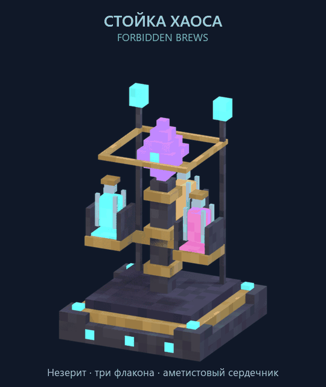
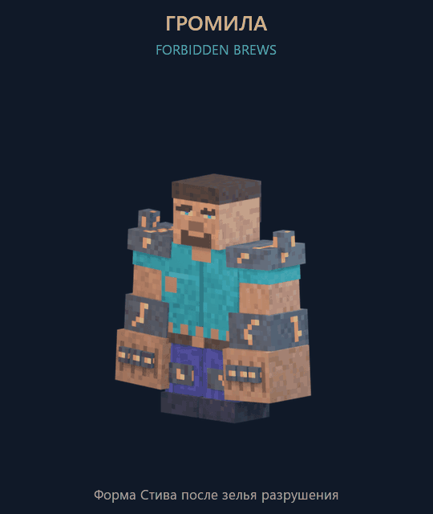
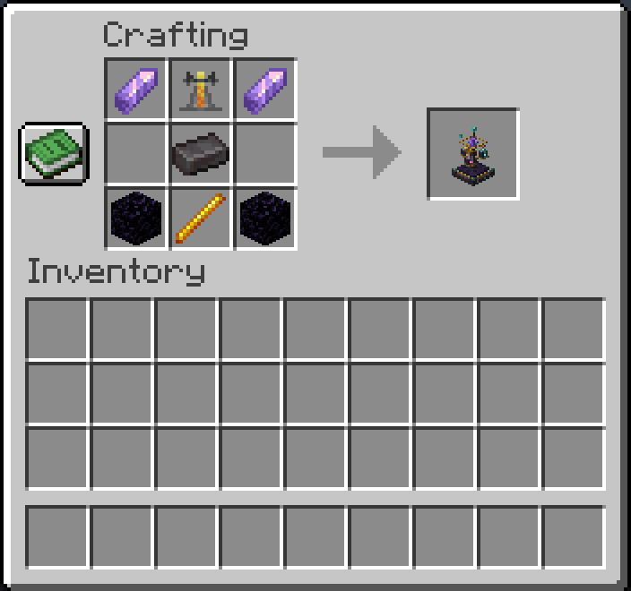
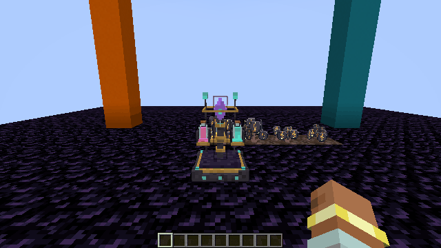
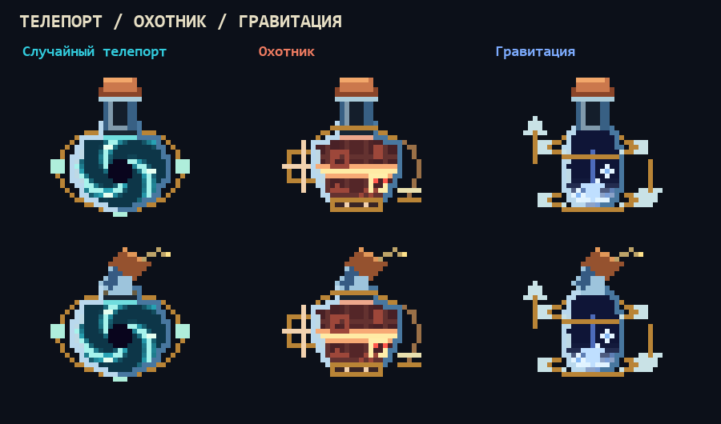
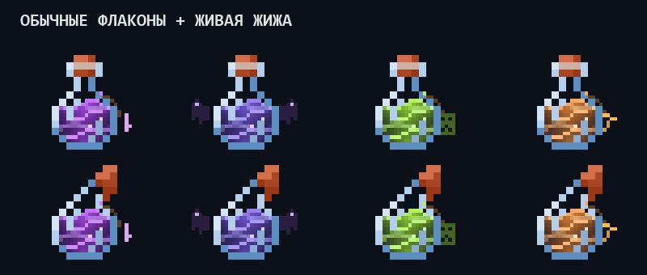
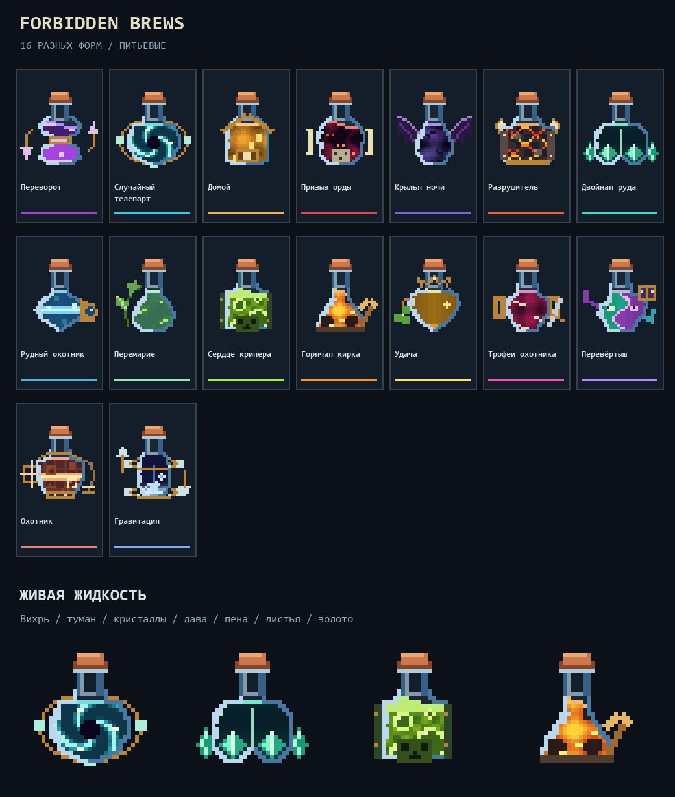
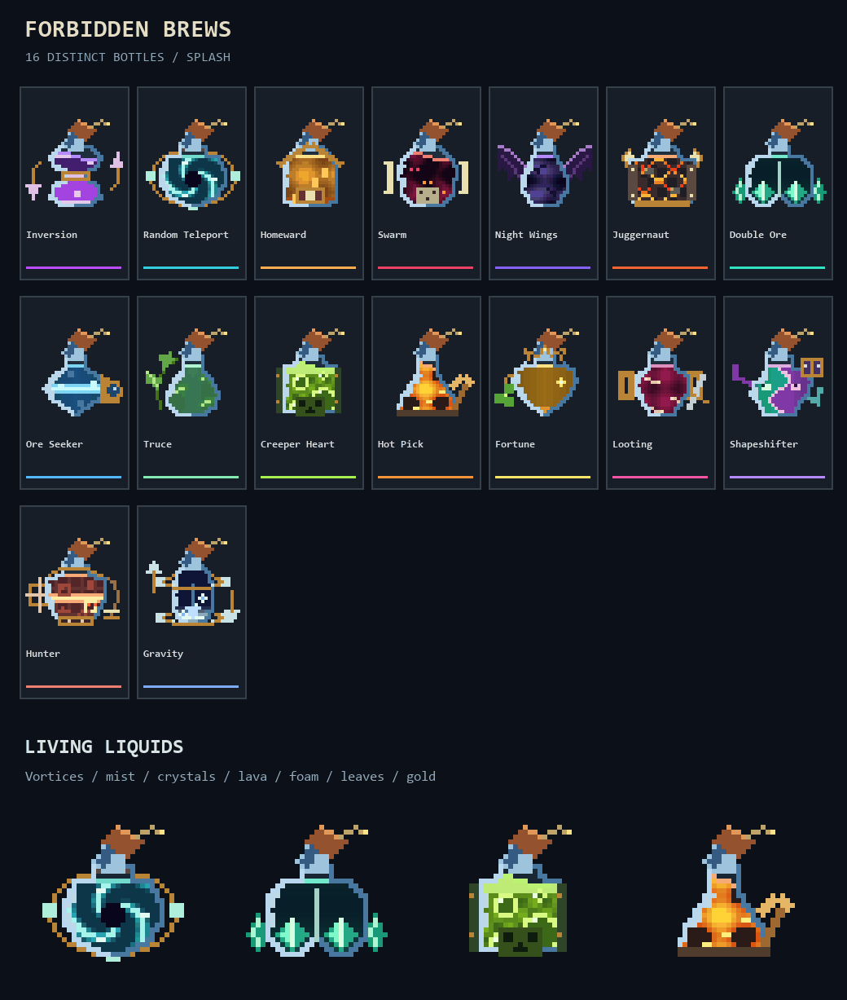

# Forbidden Brews

Мод для Minecraft с собственным зельеварением, незеритовым наростом, стойкой хаоса, моделью громилы и анимированными иконками зелий. В **0.4.0** работают «Удача» I–III, «Добыча» I–III, «Домой», «Случайная телепортация», «Двойная руда», «Горячая кирка», «Переворот» и «Сердце крипера», включая взрывные версии: **24 предмета и 24 рецепта варки**. **16 зелий × 2 версии = 32 иконки.** У каждого зелья своя форма флакона, заметные украшения и отдельная структура содержимого.

## Стойка хаоса и громила





Стойка — игровой блок с незеритовым основанием, тремя держателями для зелий, золотым кольцом и аметистовым сердечником. Её можно скрафтить, поставить и открыть. Открывается собственный интерфейс: основа, незеритовый нарост, четыре места для компонентов, топливо и готовое зелье. Нажмите на пустую ячейку результата, чтобы выбрать зелье; улучшения и взрывные варианты появляются после установки подходящего зелья в центральную ячейку; при варке движутся пузырьки и заполняется шкала. Инвентарь и прогресс сохраняются; доступны воронки. Светящиеся участки текстуры анимированы. Вращение геометрии в GIF показано как художественное превью; в игре пока движется текстура.



Рецепт: **1 слиток незерита**, обычная варочная стойка, 2 осколка аметиста, 2 обсидиана и стержень ифрита. Для добычи стойки нужна алмазная или незеритовая кирка. В творческом режиме она находится среди функциональных блоков.

Громила — кубическая форма мутировавшего Стива высотой около 2,9 блока: рваная бирюзовая рубаха, фиолетовые штаны, большие кулаки, каменные наросты и оранжевые трещины. В Blockbench подготовлены `idle`, `walk` и `smash`, а в Blender — редактируемые действия и анимация удара. **Модель готова; моб, превращение игрока и разрушение области 4×4 пока не подключены.** Остальные 8 видов зелий пока представлены иконками и описанием будущих эффектов.

- [Скачать сборки 0.4.0](releases/0.4.0/): Forge **1.20.1**, NeoForge и Fabric **1.21.1**. Для Fabric дополнительно нужен Fabric API 0.116.17+1.21.1.
- [Модели Blockbench](art/blockbench/), [исходники Blender](art/blender/) и [GLB](art/models/).
- [Описание моделей, сборки и проверок](docs/models.md).

Сборки для трёх загрузчиков успешно компилируются. Проверки нового зельеварения и запись интерфейса описаны в [руководстве по игре](docs/brewing.md).

## Зельеварение 0.4.0


Незеритовый нарост: **обычный нарост + лом незерита → 1 незеритовый нарост**. Его можно посадить на песок душ; зрелое растение даёт 2–4 нароста. Светящиеся прожилки анимированы на всех четырёх стадиях роста.


«Удача» работает как зачарование **Fortune** и складывается с удачей инструмента. Длительность уровней I/II/III: **2/5/8 минут**.

Новое в 0.4.0: «Переворот» разворачивает мир и предмет в руке на 180° на 2 минуты, а «Сердце крипера» создаёт взрыв при питье; его взрывной флакон детонирует как TNT в точке попадания. Молоко снимает переворот. Меню выбора показывает восемь базовых зелий в двух колонках.



«Случайная телепортация» ищет безопасное место в текущем измерении в пределах 2048 блоков по каждой горизонтальной оси; «Двойная руда» удваивает ресурсы после расчёта удачи; «Горячая кирка» сразу переплавляет добытую руду. Два горных эффекта действуют по 2 минуты и работают вместе. Шёлковое касание сохраняет цельные блоки.


Каждая варка требует **1 незеритовый нарост**. Огненный порошок даёт 20 зарядов. Для первого уровня нужна бутылочка воды; последующие уровни варятся из предыдущего зелья. Редкость компонентов растёт с силой эффекта. [Все рецепты и инструкция](docs/brewing.md).

## Быстрый просмотр

Случайная телепортация, охотник и гравитация — питьевые и взрывные версии:





Питьевые версии:



Взрывные версии:



## Файлы

- `art/icons/drink/` и `art/icons/splash/` — отдельные PNG 32×32 с прозрачным фоном.
- `art/minecraft/assets/forbidden_brews/textures/item/` — анимированные PNG 32×768: 24 кадра 32×32 вертикально, рядом `.png.mcmeta`.
- `previews/individual/` — отдельная GIF для каждого зелья и каждой версии.
- `art/catalog.json` — названия, цвета, формы флаконов, структуры содержимого и задуманные эффекты.
- `tools/build_pixel_potions.py` — воспроизводимая сборка иконок и GIF.
- `tools/potion_designs.py` — авторская пиксельная графика и отдельные анимации всех 16 составов.

## Формы и содержимое

| Зелье | Флакон и заметные детали | Анимированное содержимое |
|---|---|---|
| Переворот | Песочные часы, встречные стрелки | Два слоя и капли, движущиеся навстречу |
| Случайный телепорт | Круглый диск, кольцо портала | Вихрь с тёмным центром и вращающимися огнями |
| Домой | Фонарь, крыша и светящееся окно | Вязкий мёд, тёплые сгустки и угольки |
| Призыв орды | Угловатая колба, кости и череп | Багровый дым и вспыхивающие глаза |
| Крылья ночи | Удлинённая капля, большие крылья | Чернильный туман и движущиеся силуэты |
| Разрушитель | Широкая бронированная бутыль, рога | Каменные обломки и раскалённые трещины |
| Двойная руда | Две камеры, боковые кристаллы | Парные кристаллы растут в разных фазах |
| Рудный охотник | Ромб, крупный глаз-самоцвет | Сканирующий луч и проявляющиеся крупицы руды |
| Перемирие | Изогнутый сосуд, лоза и листья | Плавающие листья в спокойном зелёном геле |
| Сердце крипера | Прямоугольный сосуд, усиления и лицо крипера | Кислотная пена и пульсирующие газовые пузыри |
| Горячая кирка | Колба-печь, крупная кирка | Лава, чёрная корка и разрывы расплава |
| Удача | Сердцевидный сосуд, корона и клевер | Золотые хлопья и вспыхивающие звёзды |
| Трофеи охотника | Амфора, боковые рукояти и клинок | Рубиновые сгустки и белые осколки трофеев |
| Перевёртыш | Асимметричный сосуд, усики и маска | Две массы меняют границу, а глаза — облик |
| Охотник | Колба-щит с прицелом и подвеской ловушки | Сканирующая сетка проявляет силуэты мобов и ловушек |
| Гравитация | Парящая капсула с магнитными кольцами и стрелками | Серебристая масса и капли перемещаются между дном и верхом |

Взрывные версии сохраняют индивидуальную форму и состав; у них наклонённое горлышко, закрытая пробка и искрящийся фитиль.

| Зелье | Задуманный эффект |
|---|---|
| Переворот | Переворачивает экран |
| Случайный телепорт | Телепортирует в случайную точку карты; ранее назывался «Дикий прыжок» |
| Домой | Возвращает домой |
| Призыв орды | Повышает спавн мобов даже днём |
| Крылья ночи | Превращает в летучую мышь |
| Разрушитель | Превращает в монстра, ломающего блоки 4×4 |
| Двойная руда | Умножает руду ×2 |
| Рудный охотник | Подсвечивает ближайшую руду |
| Перемирие | Мобы мирны, пока их не ударить |
| Сердце крипера | Взрыв с небольшим уроном; взрывная версия — как TNT |
| Горячая кирка | Мгновенная переплавка добываемой руды |
| Удача | Добавляет уровни Fortune к удаче инструмента |
| Трофеи охотника | Повышает добычу с мобов |
| Перевёртыш | Превращает в случайного моба |
| Охотник | Подсвечивает через стены всех враждебных мобов, кнопки, нажимные плиты и нити растяжек |
| Гравитация | Первое нажатие прыжка меняет гравитацию и тянет к небу; второе возвращает гравитацию к земле |

«Рудный охотник» продолжает подсвечивать руду. Новое зелье «Охотник» предназначено для мобов и ловушек. Для гравитации нажатие прыжка задумано как переключатель направления, в том числе когда игрок уже находится в воздухе. Питьевые и взрывные версии всех восьми реализованных составов работают; остальные ждут реализации.

Флаконы зелий остаются двумерными предметными текстурами. Новые 3D-модели предназначены только для стойки и громилы.

## Пересборка

Нужны Python и Pillow. Клиентский JAR Minecraft больше не нужен:

```sh
python tools/build_pixel_potions.py
```

GIF и `.mcmeta` воспроизводят 24 кадра по 100 мс: бесконечный цикл 2,4 секунды. Текстуры уже окрашены; дополнительное стандартное тонирование зелий не требуется. Мягкое освещение от предмета в мире не реализовано: сияние нарисовано внутри самой текстуры.

Все текущие контуры, пробки, украшения и анимации нарисованы специально для Forbidden Brews. Пиксельная палитра стекла и простые ступенчатые края сохраняют стиль Minecraft. Изображения в превью увеличены без размытия. Для создания подписей скрипт использует системный шрифт Consolas на Windows.
