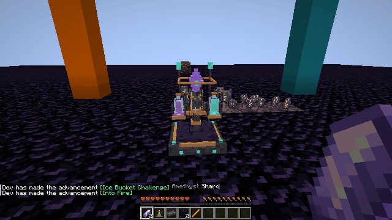
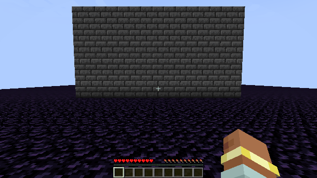
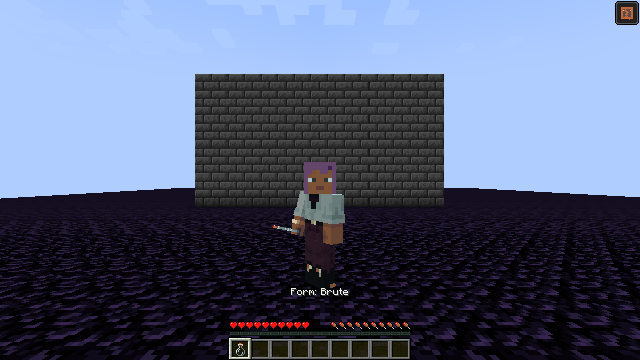
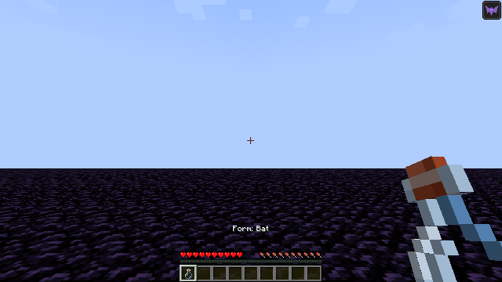
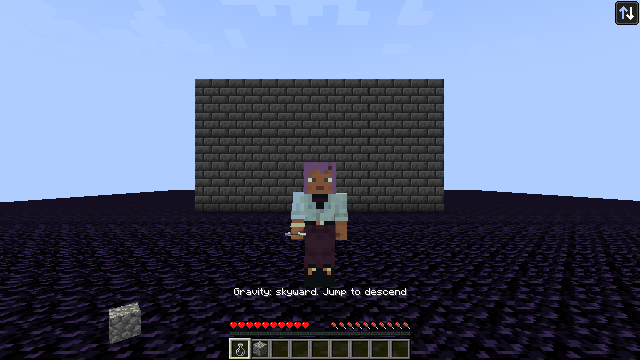

# Forbidden Brews


Brew **16 potion families, 44 drinkable/splash items and 44 recipes** in a Netherite-powered Chaos Brewing Stand. Each bottle has its own pixel silhouette, decorations and animated liquid: portals, crystals, foam, molten rock and more.

**[Download hotfix 0.7.3](releases/0.7.3/)** · **[Every recipe and controls](docs/brewing.md)** · **[Models](docs/models.md)** · **[Compatibility](docs/compatibility.md)** · **[Publication status](publishing/README.md)**

| Minecraft | Loader | Requirements |
|---|---|---|
| 1.20.1 | Forge 47.4.0+ | Java 17 |
| 1.21.1 | NeoForge 21.1.252+ | Java 21 |
| 1.21.1 | Fabric Loader 0.16.14+ | Java 21, Fabric API 0.116.17+1.21.1 or compatible newer 1.21.1 release |

Install **one** matching JAR on both client and server. These targets have the broadest mod ecosystems among the versions compared; this measures available mods, not player population.

Version **0.7.3** fixes Brute/Ore Seeker compatibility in cramped mines, adds charged area attacks with knockback, expands Shapeshifter to registered mobs including bosses, rotates the player and camera under reversed gravity, and fades missing recipe ingredients. [Release details](releases/0.7.3/).

## Chaos brewing

### Craft the Chaos Brewing Stand

Use a crafting table: **2 Amethyst Shards, 1 Brewing Stand, 1 Netherite Ingot, 2 Obsidian and 1 Blaze Rod**. The recipe produces one Chaos Brewing Stand.

**Top row:** Amethyst Shard · Brewing Stand · Amethyst Shard  
**Middle row:** empty · Netherite Ingot · empty  
**Bottom row:** Obsidian · Blaze Rod · Obsidian


### The stand in Minecraft



### Animated brewing interface


Click the empty result slot to choose a potion directly. Insert a drinkable potion in the centre to reveal its upgrade and splash recipes. The interface provides a base bottle, Netherite Wart, four ingredient slots, Blaze Powder fuel and animated progress. Inventory, progress and hopper automation persist across saves.

Craft **Nether Wart + Netherite Scrap → Netherite Wart**, then plant it on Soul Sand. A mature crop yields 2–4 Wart before Fortune. Every brew, including upgrades and splash conversion, consumes one Netherite Wart. One Blaze Powder fuels 20 brews.


## Potions

| Family | Effect |
|---|---|
| Fortune I–III | Adds 1/2/3 Fortune levels to block drops, stacking with the tool; lasts 2/5/8 minutes. |
| Looting I–III | Adds 1/2/3 Looting levels to mob drops, stacking with the weapon; lasts 2/5/8 minutes. |
| Homeward | Returns players to a safe spawn destination. |
| Random Teleport | Finds a safe location in the current dimension, up to ±2048 blocks on each horizontal axis. |
| Double Ore | Doubles ore resource drops after Fortune; respects Silk Touch. |
| Hot Pick | Immediately smelts ore drops using the world's furnace recipes. |
| Inversion I–III | Harmful: rotates the world and held item 180° for 11/22/45 seconds; menus remain readable. |
| Creeper Heart | Drinking: power-3 explosion with reduced self-damage. Throwing: power-4 TNT-like explosion. |
| Truce | Stops hostile attacks until you strike that particular mob. |
| Swarm | Harmful: attempts additional hostile spawns even in daylight, with safe placement and local caps. |
| Ore Seeker | Reveals **all loaded ores within 32 blocks** through walls, using their actual textures. |
| Hunter | Reveals hostile mobs within 32 blocks and buttons, pressure plates and tripwires within 24 blocks. |
| Night Wings | Bat form; double-tap Jump to fly, hold Jump to rise, Sneak to descend. |
| Juggernaut | Brute form: **double maximum health, +3 attack damage, 4×4 mining**, charged area attacks and strong knockback. Blocks harder than Obsidian and unbreakable blocks cannot be mined. |
| Shapeshifter | A persistent random form from registered mobs, including modded mobs and the Ender Dragon. Reapplying the effect changes form; the Bat also grants flight. |
| Gravity | Each separate Jump press toggles ascent/descent. Reversed gravity turns the player model and camera upside down. |

Timed families without levels last two minutes. Homeward, Random Teleport and Creeper Heart are instant. Every potion has a splash version; timed splash duration decreases with distance as in vanilla. Milk removes active effects.









## Languages

English (US/UK), Russian, German, Spanish, French, Brazilian Portuguese, Simplified Chinese, Japanese, Korean and Ukrainian. All eleven packs contain all 80 item, effect, block, interface and message keys. Translations are AI-assisted; native-speaker corrections are welcome. Current release descriptions and GIF captions are English. Historical captures retain their original language.

## Development

Shared gameplay: `common/`; version adapters: `versions/`; loader registrations: `platforms/`. Potions use flat animated 32×32 sprites with 24 frames. Only the stand and Brute use 3D geometry. Editable Blender, Blockbench and GLB sources are in `art/`.

```sh
python tools/build_pixel_potions.py
python tools/build_runtime_art.py
python tools/stage_runtime_resources.py
./gradlew -Ptarget=forge-1.20.1 build
./gradlew -Ptarget=neoforge-1.21.1 build
./gradlew -Ptarget=fabric-1.21.1 build
python tools/package_release.py
```

Use Java 17 for Forge and Java 21 for the other targets. `-PgameTests runGameTestServer` enables the Forge server integration suite; `-PvisualTest` enables the separate local Forge recording fixture. Test fixtures are excluded from release JARs.

Version 0.7.3 passed **36 Forge GameTests**, including cramped-mine morph compatibility, area combat, registry mob forms, effect refresh and save migration. Native English Forge client/server checks cover ore/model coexistence, area knockback, the dragon renderer, gravity orientation and ingredient hints. All three production loader builds are checked. NeoForge/Fabric have earlier server startup checks; their client recordings and GameTests have not been run.

## Credits

Concept and direction: **Magersers**. Code, procedural pixel art, localization and documentation were substantially created with AI assistance. The repository logo was generated with OpenAI's image tool; see its [prompt and provenance](art/branding/README.md). Gameplay media uses actual Minecraft recordings and procedural sprite previews. The generated logo is used for GitHub and CurseForge branding with disclosure; Modrinth and Planet Minecraft use actual in-game images.

[All Rights Reserved](LICENSE). Not an official Minecraft product; not approved by or associated with Mojang or Microsoft.
