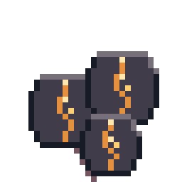
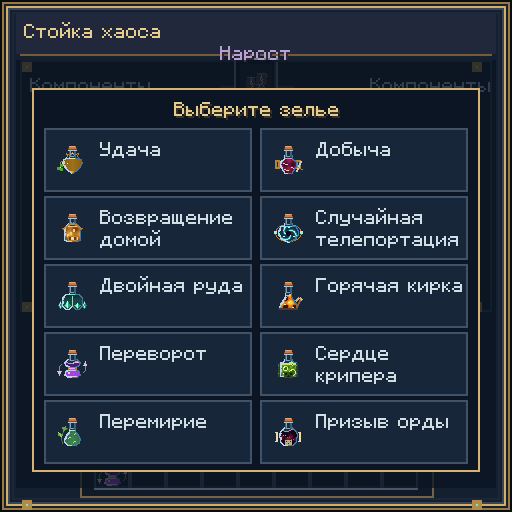
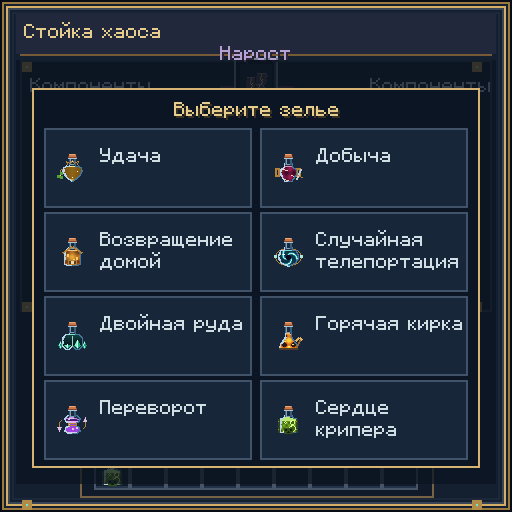
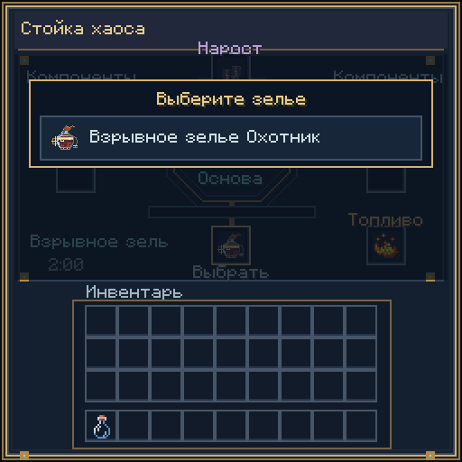
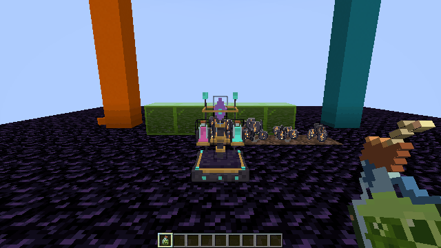

# Зельеварение Forbidden Brews 0.4.2

## Установка

Forge 1.20.1 + Java 17, NeoForge 1.21.1 + Java 21 или Fabric 1.21.1 + Java 21 и Fabric API 0.116.17+1.21.1. Установите соответствующий JAR на клиент и сервер. [Готовые файлы](../releases/0.4.2/). Версии загрузчиков в сборке: Forge 47.4.0, NeoForge 21.1.252, Fabric Loader 0.16.14.

## Стойка и нарост

Крафт стойки не изменён: аметист / обычная стойка / аметист; пусто / слиток незерита / пусто; обсидиан / стержень ифрита / обсидиан.

Крафт нароста бесформенный: **1 обычный нарост + 1 лом незерита → 1 незеритовый нарост**. Нажмите предметом на песок душ. Рост происходит естественными случайными тиками, как у обычного нароста; освещение и вода не нужны. Почва душ не подходит, костная мука не ускоряет рост. Незрелое растение возвращает 1 нарост, зрелое — 2–4; зачарование «Удача» увеличивает сбор. Каждый рецепт ниже расходует 1 нарост, в том числе повышение уровня и взрывные версии.



## Как варить

1. Откройте стойку правой кнопкой. Нажмите на пустую ячейку результата с подписью «Выбрать»; пустая центральная ячейка тоже открывает выбор. В меню видны только подходящие рецепты: при пустой основе или воде — восемь базовых зелий в двух колонках: Удача I, Добыча I, Домой, Случайная телепортация, Двойная руда, Горячая кирка, Переворот I и Сердце крипера. Выберите зелье одним нажатием. Наведите на затемнённые компоненты, чтобы увидеть названия и нужные количества.
2. Для улучшения сначала положите готовое **питьевое** зелье в центральную ячейку. Удача I открывает Удачу II и взрывную Удачу I; Удача II — Удачу III и взрывную Удачу II. Добыча и Переворот работают аналогично. Зелья III уровня, Домой и составы без уровней открывают только свою взрывную версию. Взрывное зелье не подходит как основа улучшения.
3. Положите основу в центральное место, незеритовый нарост — над ним, компоненты — в четыре боковых места в любом порядке. Количество в одном месте можно увеличить; лишний материал другого вида мешает варке.
4. Добавьте огненный порошок справа внизу: 1 порошок = 20 приготовлений. После выбора варка начинается автоматически, когда компоненты выбранного рецепта верны и выход свободен. Сервер проверяет доступность выбранного рецепта. При смене основы несовместимый выбор сбрасывается. Без ручного выбора сохраняется автоматическая варка по компонентам для воронок.
5. Заберите готовое зелье из нижнего центрального места. При отсутствии нужных компонентов прогресс сбрасывается; выгрузка мира сохраняет действующую варку.



Воронки: сверху — нарост и компоненты, сбоку — основа и топливо, снизу — выдача результата. При разрушении стойки содержимое выпадает. Инвентарь стойки версии 0.1.0 переносится без потери предметов; старые бутылки и компоненты могут потребовать ручной перестановки.

## Рецепты

Во **всех строках дополнительно нужен 1 незеритовый нарост** и 1 заряд топлива. Время указано при 20 TPS.

| Результат | Основа | Компоненты | Время |
|---|---|---|---|
| Удача I | Бутылочка воды | Кроличья лапка ×1, слиток золота ×4, изумруд ×1 | 10 с |
| Удача II | Удача I | Кроличья лапка ×2, алмаз ×1, изумрудный блок ×1 | 15 с |
| Удача III | Удача II | Золотое яблоко ×1, алмазный блок ×1, звезда Незера ×1 | 20 с |
| Добыча I | Бутылочка воды | Слеза гаста ×1, слиток железа ×4, стержень ифрита ×1 | 12 с |
| Добыча II | Добыча I | Слеза гаста ×2, алмаз ×2, жемчуг Края ×2 | 17 с |
| Добыча III | Добыча II | Звезда Незера ×1, алмазный блок ×1, лом незерита ×1 | 22 с |
| Домой | Бутылочка воды | Компас ×1, жемчуг Края ×2, осколок аметиста ×4 | 12 с |
| Случайная телепортация | Бутылочка воды | Плод хоруса ×4, жемчуг Края ×2, осколок аметиста ×8, осколок эха ×1 | 16 с |
| Двойная руда | Бутылочка воды | Алмаз ×2, рудное золото ×4, осколок аметиста ×8, лом незерита ×1 | 18 с |
| Горячая кирка | Бутылочка воды | Сгусток магмы ×2, плавильная печь ×1, стержень ифрита ×2, рудное железо ×8 | 14 с |
| Переворот I | Бутылочка воды | Маринованный паучий глаз ×2, мембрана фантома ×1, осколок аметиста ×6, редстоун ×4 | 14 с |
| Переворот II | Переворот I | Маринованный паучий глаз ×3, светокаменная пыль ×4, мембрана фантома ×2, осколок аметиста ×8 | 15 с |
| Переворот III | Переворот II | Маринованный паучий глаз ×4, светокаменная пыль ×8, слеза гаста ×1, осколок эха ×1 | 20 с |
| Сердце крипера | Бутылочка воды | TNT ×1, порох ×4, слизь ×2, огненный порошок ×2 | 18 с |
| Взрывная версия любого зелья выше | Соответствующее питьевое зелье | Порох ×2 | 8 с |





## Эффекты

«Удача» добавляет **+1/+2/+3 уровня зачарования Fortune при добыче блоков** и складывается с удачей кирки, топора, лопаты или мотыги. Например, Fortune III на инструменте + зелье Удачи II дают Fortune V при расчёте добычи. Используются обычные таблицы добычи Minecraft: руды, культуры и другие блоки реагируют на Fortune по своим правилам. Шёлковое касание сохраняет ванильный приоритет. Настоящий инструмент не меняется: бонус применяется к временной копии только для расчёта выпадения. Ванильное «Везение» Luck остаётся отдельным эффектом.

«Добыча» добавляет **+1/+2/+3 уровня Looting** при убийстве мобов и складывается с зачарованием оружия. При обычном питье длительность обоих эффектов: I — **2 минуты**, II — **5 минут**, III — **8 минут**. При взрыве длительность уменьшается с расстоянием до попадания, по ванильным правилам.

«Домой» мгновенно переносит игрока к его доступной кровати/якорю или принудительной точке возрождения. Если точка недоступна, используется безопасное место рядом с точкой появления мира. Проверяются границы мира, место для игрока, вода/лава и опасные блоки; если безопасного места нет, появляется сообщение. Скорость и накопленный урон от падения сбрасываются. Взрывная версия возвращает домой попавших в область игроков; у мобов нет домашней точки, на них эффект не действует.

«Случайная телепортация» мгновенно запускает поиск безопасного места в **текущем измерении**. По каждой горизонтальной оси выбирается смещение до ±2048 блоков; хотя бы по одной оси оно не меньше 256 блоков. Проверяются граница мира, твёрдая опора, место для головы, жидкости, огонь и опасные блоки. В Незере поиск идёт ниже потолка, в Крае пустота не считается местом посадки. Загрузка далёкого чанка выполняется без блокировки игрового тика; сообщение показывает, что поиск продолжается. Максимум — 12 попыток. Если места нет, игрок остаётся на месте и получает сообщение об отмене; смена измерения, смерть или выход отменяют ожидающий перенос. После переноса скорость и урон от падения сбрасываются, появляются частицы портала. Взрывная версия запускает отдельный поиск для каждого попавшего в область игрока; на мобов эффект не действует.

«Двойная руда» на **2 минуты** удваивает ресурсы, выпавшие из руды **после** удачи инструмента и зелья. Например, обычный алмаз ×1 превращается в ×2, а выпадение ×5 с Fortune — в ×10. Обычные блоки и урожай не удваиваются. Цельные блоки руды и древние обломки без переплавки остаются по одному: их нельзя бесконечно размножать повторной установкой.

«Горячая кирка» на **2 минуты** переплавляет добычу руды по действующим печным рецептам мира: рудное железо/золото/медь превращается в слитки, древние обломки — в лом незерита. Алмазы, редстоун и другие ресурсы без печного рецепта сохраняются. Топливо в момент добычи не требуется. «Двойная руда», «Горячая кирка» и «Удача» работают вместе: сначала обычная добыча с Fortune, затем переплавка и удвоение ресурсов. Большие количества разбиваются на допустимые стопки. Шёлковое касание имеет приоритет и сохраняет исходный блок без удвоения и переплавки. Обычный опыт от добычи остаётся ванильным; отдельный печной опыт не добавляется. Взрывные версии двух горных зелий применяют те же эффекты с ванильным уменьшением длительности по расстоянию.

«Переворот» — **отрицательный эффект**: **I — 11 секунд, II — 22 секунды, III — 45 секунд**. Чем выше уровень, тем дольше длится эффект. Каждый уровень разворачивает изображение мира и предмет в руке на **180°**. Работает от первого и третьего лица, а также при наблюдении через камеру существа с эффектом. Управление и положение игрока не меняются. Инвентарь, меню и HUD остаются читаемыми. По окончании или после молока изображение сразу возвращается в обычное положение. Взрывная версия накладывает эффект с ванильным уменьшением длительности по расстоянию.

«Сердце крипера» при питье мгновенно создаёт **взрыв силы 3**, как обычный крипер. Выпивший исключён из полного урона этого взрыва и получает отдельно **4 единицы базового урона (2 сердца на нормальной сложности без защиты)**. Этот урон изменяется обычными правилами сложности и защиты Minecraft. Соседние существа получают обычный взрывной урон, хрупкие блоки разрушаются. Низкое здоровье по-прежнему может привести к смерти; зелье не даёт бессмертия.

Взрывное «Сердце крипера» создаёт **один взрыв силы 4, как TNT**, при попадании в блок или существо. Взрыв возникает в точке удара, не отдельно возле каждого моба. Бросивший считается владельцем урона; флакон удаляется после первого попадания. Ограничение самоурона питьевой версии к броску не применяется. Обе версии используют ванильный взрыв без поджигания, правила разрушения и выпадения блоков для TNT и события загрузчика.



Предметы находятся в творческой вкладке еды и напитков, нарост — среди ингредиентов, стойка — среди функциональных блоков. Пример команды: `/give @s forbidden_brews:looting_2_drink`. Варианты ID: `fortune_1_drink` … `fortune_3_splash`, `looting_1_drink` … `looting_3_splash`, `homeward_1_drink`, `homeward_1_splash`, `wild_teleport_1_drink/splash`, `ore_double_1_drink/splash`, `hot_pick_1_drink/splash`, `inversion_1_drink` … `inversion_3_splash`, `creeper_1_drink/splash` (для каждого выбирайте суффикс `_drink` или `_splash`).

## Разработка и проверка

Общая серверная логика лежит в `common/`, адаптеры NBT/компонентов и эффектов — в `versions/`, регистрации — в `platforms/`. Клиентская анимация не управляет расходом предметов: всё проверяет сервер. Руды определяются общим тегом `forbidden_brews:ores`: восемь ванильных групп руд, кварцевая руда, древние обломки и необязательные теги `forge:ores` / `c:ores`. Его можно расширить датапаком для совместимых руд других модов. Переплавка берёт рецепты текущего мира, включая датапаки. Рецепты варки определены в `ChaosRecipes.java`; крафт и добыча нароста — JSON для каждой версии.

Пересоздание графики и ресурсов:

```sh
python tools/build_runtime_art.py
python tools/stage_runtime_resources.py
./gradlew -Ptarget=forge-1.20.1 build
./gradlew -Ptarget=neoforge-1.21.1 build
./gradlew -Ptarget=fabric-1.21.1 build
```

Серверные GameTest:

```sh
./gradlew -Ptarget=forge-1.20.1 -PgameTests runGameTestServer
```

Все три сборки прошли `build`. На Forge в настоящем сервере прошли **19 GameTest**: крафты, все **28 рецептов**, точный расход, сохранение и миграция, удача/добыча и сложение с инструментами, реальные горные таблицы добычи, безопасная телепортация и возвращение домой, культура, броски и попадания, фильтрация рецептов и серверная проверка выбора. Проверка Переворота покрывает отрицательную категорию, точные длительности и уровни при питье и прямом попадании взрывным флаконом I–III, снятие молоком и доступные улучшения. Проверки взрывов покрывают ограниченный самоурон, бутылку, урон соседнему мобу и разрушение стекла при питье; один взрыв при попадании в нескольких мобов, владельца урона и повторный вызов попадания; удар в блок, удаление флакона и силу TNT 4. Визуальная запись версии 0.4.1: клиентский сценарий Forge выбирает Переворот I и затем улучшение II в настоящем интерфейсе с проверкой серверной синхронизации; записывает варку и отрицательный эффект III. Проверка реальной матрицы отрисовки подтверждает поворот 180° и возврат после молока. NeoForge и Fabric также запущены как отдельные локальные серверы и штатно остановлены. Клиентская визуальная проверка и GameTest для них пока не выполнены.

Тестовые файлы и визуальный сценарий подключаются отдельными флагами и исключены из выпускаемых JAR. Для визуального сценария Forge предусмотрен `-PvisualTest`: отдельный локальный тестовый сервер 127.0.0.1:25584 и клиент, сохраняющий кадры интерфейса. Он предназначен только для отдельного тестового мира. `tools/package_release.py` проверяет состав трёх обычных JAR и пишет SHA-256 в манифест.

Остальные эффекты, превращение в громилу и разрушение блоков пока не подключены. Их иконки и модели сохранены для следующих этапов.
