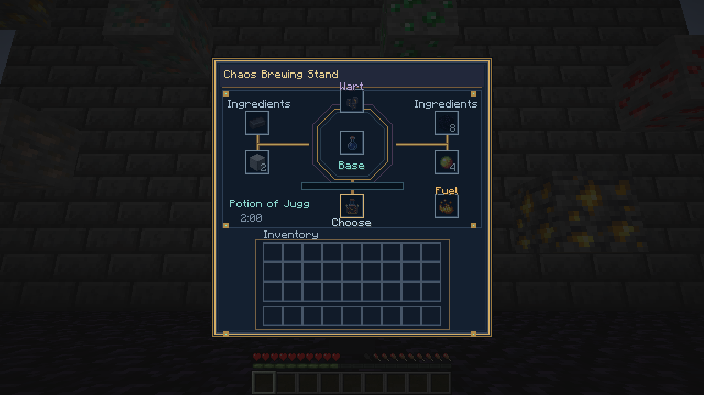
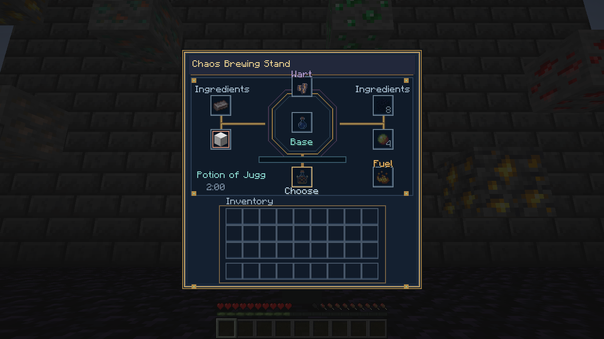
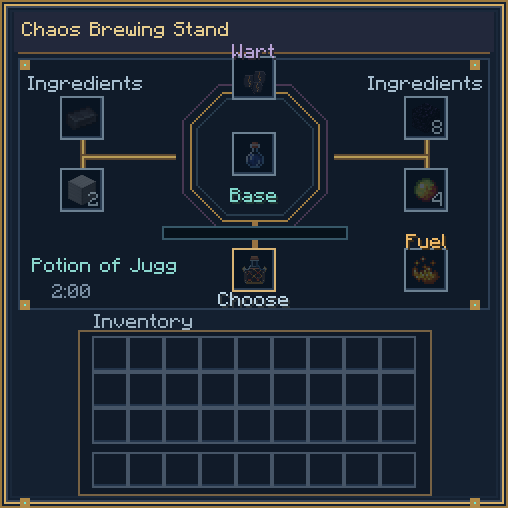
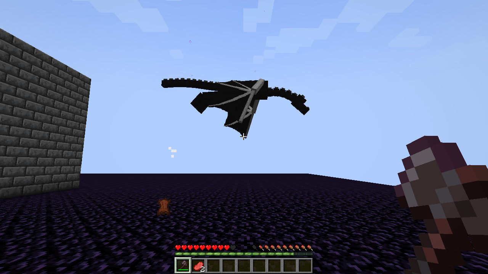
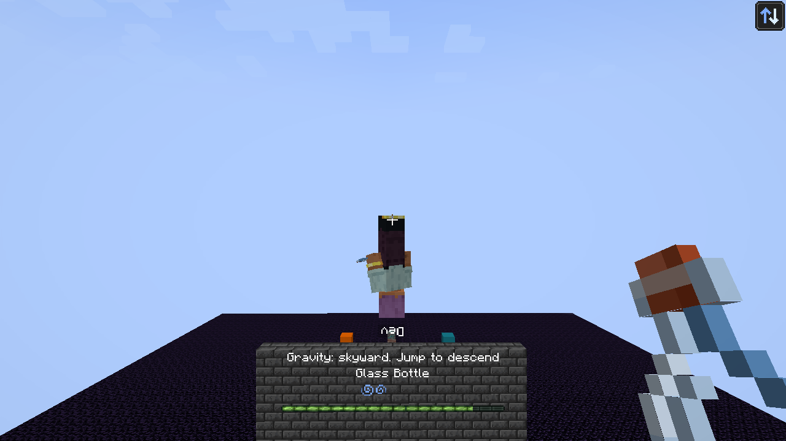
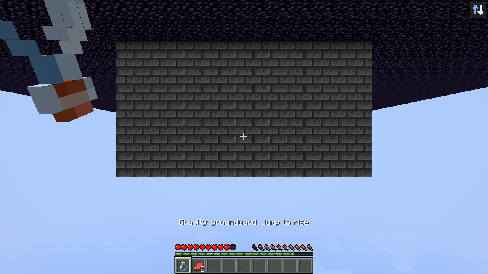

# Forbidden Brews 0.7.3 — Brute combat and expanded transformations

**Withdrawn:** the Forge CurseForge upload is archived after a Random Teleport bug report. No GitHub release or tag was published for 0.7.3. This build is superseded by the [0.7.4 hotfix](../0.7.4/).

- An active Juggernaut no longer resets in cramped mines while drinking Ore Seeker. Initial transformation still needs headroom; milk and effect expiry restore the original form.
- Charged, successful Brute melee attacks hit nearby mobs within three blocks of the target for 60% of the primary damage, with strong knockback. Walls, allied mobs and owned tameable pets are excluded. Double maximum health, +3 attack damage, 4×4 harvesting and protected-block restrictions remain.
- Shapeshifter discovers registered mobs, including compatible modded mobs and bosses such as the Ender Dragon. Large forms need open space. Equal/shorter effect reapplication changes form while preserving the longer native remaining duration. Registry-key saves preserve forms and migrate 0.7.2 saves.
- Reversed gravity turns the player model and world/hand view upside down. Second jump or effect removal restores orientation; HUD and menus remain readable.
- Missing Chaos Stand ingredients appear pale and translucent. Inserted resources are fully bright; insufficient totals receive a copper outline.

| Minecraft / loader | Download | Requirements |
|---|---|---|
| Forge 1.20.1 | [Forge JAR](forbidden-brews-forge-1.20.1-0.7.3.jar) | Forge 47.4.0+, Java 17 |
| NeoForge 1.21.1 | [NeoForge JAR](forbidden-brews-neoforge-1.21.1-0.7.3.jar) | NeoForge 21.1.252+, Java 21 |
| Fabric 1.21.1 | [Fabric JAR](forbidden-brews-fabric-1.21.1-0.7.3.jar) | Loader 0.16.14+, Fabric API 0.116.17+1.21.1 or compatible newer 1.21.1 release, Java 21 |

Replace the previous Forbidden Brews JAR with the matching new JAR on client and server. Use one loader file only. [SHA-256 manifest](manifest.json). [Recipes and controls](../../docs/brewing.md).

Verification: the cramped-mine regression failed before the fix. All **36 Forge GameTests** passed after the changes. Native English Forge client/server captures check ore/form compatibility, Brute 40 HP, charged area knockback, dragon rendering, gravity model/camera rotation and ghost/inserted ingredients. Production builds and packaging are checked for all three loaders. No new NeoForge/Fabric client recording is claimed.

